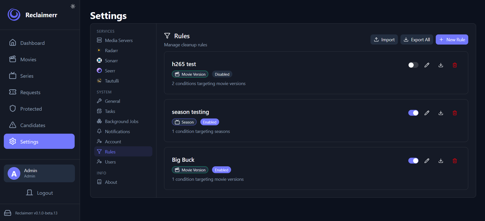
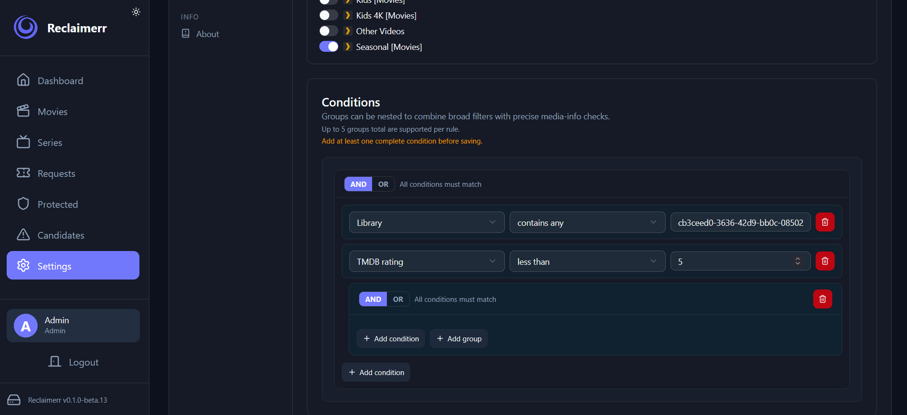
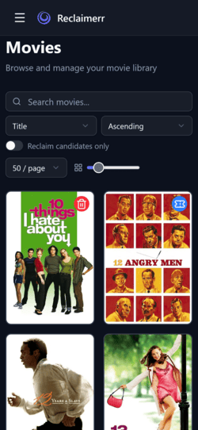
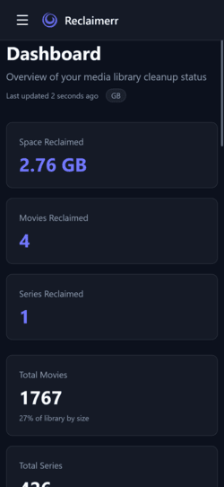
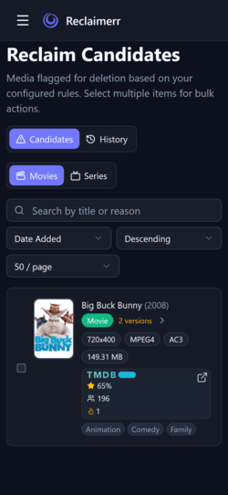

<p align="center">
    
</p>

<p align="center">
<!-- desktop build -->  <picture></picture>
<!-- docker build -->  <picture></picture>
<!-- frontend -->  <picture></picture>
<!-- backend -->  <picture></picture>
<!-- latest release -->  <picture></picture>
<!-- commits since release -->  <picture></picture>
<!-- stars -->  <picture></picture>
<!-- commit activity -->  <picture></picture>
<!-- issues Open -->  <picture></picture>
<!-- issues Closed -->  <picture></picture>
<!-- license -->  <picture></picture>
</p>

**Reclaimerr** is designed to help you reclaim disk space from your media library. I was inspired to create Reclaimerr when the 100TB of storage on my home server was nearly full and I saw the rising cost of new drives. I realized it was time to start cleaning up all the unwatched and low-rated media on my server.

I explored numerous open source applications for server cleanup, and [Maintainerr](https://github.com/Maintainerr/Maintainerr) stood out as a major inspiration for Reclaimerr's design. When I began development, Maintainerr didn't support Jellyfin or Emby, though support was added to Jellyfin in [v3.0.0](https://github.com/Maintainerr/Maintainerr/releases/tag/v3.0.0), it still didn't fully meet my needs.

I needed a solution to manage a single physical media library while utilizing both Jellyfin and Plex to run filters and rules. I considered contributing to Maintainerr, but its codebase was undergoing a major refactor to add Jellyfin support.

Driven by the increasing cost of storage and the need to reclaim used disk space, inspired by Maintainerr, **Reclaimerr** was born.

## Star History

<a href="https://www.star-history.com/?repos=jessielw%2FReclaimerr&type=date&legend=top-left">
 <picture>
   <source media="(prefers-color-scheme: dark)" srcset="https://api.star-history.com/chart?repos=jessielw/Reclaimerr&type=date&theme=dark&legend=top-left" />
   <source media="(prefers-color-scheme: light)" srcset="https://api.star-history.com/chart?repos=jessielw/Reclaimerr&type=date&legend=top-left" />
   
 </picture>
</a>

# Discussions

While I prefer we utilize github's [discussions](https://github.com/jessielw/Reclaimerr/discussions) for historical purposes, I've had quite a few users ask for _Discord_. I personally am getting away from Discord ASAP, but I did create a public matrix server for discussions and some _support_. Feel free to join https://matrix.to/#/#reclaimerr:matrix.org!

# AI Disclosures

AI (LLMs) are _everywhere_ and _everyone_ is using them. I understand that many users are concerned about projects heavily generated by AI or lacking a personal touch. Reclaimerr was built from the ground up and was **not** generated using LLMs or a fork of any other project.

LLMs have only been used as a tool for tasks such as searching for information, automating repetitive work, debugging, occasional CSS/UI assistance, and minor grammar suggestions/fixes. All design and code have been written by hand, ensuring I have a deep understanding on how all the gears turn. Even this readme here is hand written and then I utilized an LLM to correct grammar and clarity 😆.

As a result, this project will close pull requests that appear to be mostly or wholly AI generated.

# Features

- Configure rules to automatically reclaim disk space
- Supports **Jellyfin**, **Plex**, and **Emby** _(all at once if needed)_
  - Designate **one** server as the **main** server; supplemental data (such as watch history) is gathered from the others if using more than one media server. **Note: All servers must manage the same physical media library**
- Automatically supplements watch data for **Jellyfin/Emby** via **playback reporting plugin** if the plugin is installed
- Supports **Tautulli** to supplement watch data for **Plex**
- Configurable task scheduling (cron/time based)
- Automatically scans media eligible for reclamation
- Media library items **protection** system
  - This system adds "protection" that will prevent them from being considered for deletion
  - Users can request protection (to be approved or denied by users with appropriate permissions)
  - Time based control for protection duration
- Users can request **deletions** for media
- Multi-user support with a permission system
- Notifications via [Apprise](https://appriseit.com/services/), supporting over **133** services at the time of writing
- Supports multiple instances of Sonarr/Radarr
- Remove or unmonitor media from Radarr and Sonarr (if configured)
- Remove requests from Seerr
- Delete files from disk
  - If Radarr or Sonarr are configured, Reclaimerr processes deletion through them, only falling back to the main server if needed
- Very lightweight and efficient; avoids spinning up disks outside of deletions (all data is sourced directly from your media servers)
- Can move instead of delete files if enabled for archival reasons
- Supports generic post action webhooks (Autopulse, etc.)
- Light and dark mode
- Responsive UI (works great on mobile)
- Powerful logical rule system
- IMDb, TMDB, and AniList metadata
- Last chance/Leaving soon (displayed on servers for media soon to be deleted)

# Additional Info

- While Reclaimerr is in early beta, the task to **automatically delete** media will **not** be enabled or visible in the UI. I do not want to risk permanent deletion of anyone's media due to a bug with full automation until the things have been **thoroughly tested**.
  - For now, only admins or users with appropriate permissions can manage deletions through the UI or API
  - Once automatic deletions are added it will be **opt in**
- While Reclaimerr is in **beta**, things are subject to change in response to user feedback and testing
- Proper documentation will be made as the app matures a bit more

# Install

## Desktop

You can use the latest [release](https://github.com/jessielw/Reclaimerr/releases) for your platform if there is a build available.

> Note: Desktop builds for Windows must be ran from **Windows 8** or greater

### How to use

You can simply execute the prebuilt binary and it'll create a **tray** icon.

- Double click (or right click the tray icon and choose "Open") to automatically open a window in your browser.
  - The server defaults to port **8000** _(as of **v0.1.0-beta8**)_. If the default port (or your chosen port) is taken, the server will attempt to find an open port within the next 10 ports.
- Right click and choose "Close" to cleanly stop the application.

### Configuration

As of **v0.1.0-beta8**, you can control a _few_ customizable options via a **.env** file. Simply place this file **beside** your **executable** before launching the server, and it will prioritize these settings.

**Example Desktop .env**

```yaml
# All of these are optional. For example, to change the port to 8049:
API_PORT=8049
# API_HOST=127.0.0.1
# CORS_ORIGINS=http://localhost:3000
# optional (only use if you want to reset or set the admin password on first launch, min 3 / max 64)
# ADMIN_PASSWORD=
```

## Docker

**Example .env**

```yaml
# directory to store application data (database, logs, static files, etc.)
DATA_DIR=./data

# optional LinuxServer container style runtime user/group remapping
# useful on Unraid and NAS setups when you want the container to run as a
# specific host UID/GID for volume permissions
# PUID=1000
# PGID=1000

# optional umask for new files/directories created by the app process
# common values: 022, 002
# UMASK=022

# optional container timezone used for cron-style task schedules and other
# process-local time behavior
# examples: America/New_York, Europe/London, UTC
# TZ=America/New_York

# API configuration
API_HOST=0.0.0.0
API_PORT=8000
CORS_ORIGINS=http://localhost:3000

# secrets - leave blank to auto-generate stable values on first launch (recommended),
# or set your own (min 32 characters, e.g. `openssl rand -hex 32`)
# JWT_SECRET=
# ENCRYPTION_KEY=

# logging (options: DEBUG, INFO, WARNING, ERROR, CRITICAL)
# LOG_LEVEL=INFO
# keep N daily rotated log files (values <=0 are clamped to 1)
# LOG_RETENTION_DAYS=30

# optional (only use if you want to reset or set the admin password on first launch, min 3 / max 64)
# ADMIN_PASSWORD=

# set to true when serving over HTTPS
# COOKIE_SECURE=false
```

**Example compose**

```yaml
services:
  reclaimerr:
    image: ghcr.io/jessielw/reclaimerr:latest
    container_name: reclaimerr
    restart: unless-stopped
    env_file: ".env"
    volumes:
      # persist app data
      - ./data:/app/data

      # bind mount for media files (adjust the host path as needed) - this is needed for
      # Reclaimerr to clean up additional files on delete when deleting via the main media server
      # directly
      - /media:/media

      # optional volume for moved files (adjust the host path as needed)
      # - /moved_files:/moved_files
    ports:
      - "8000:8000"
```

`PUID` and `PGID` are optional, but they are often needed on Unraid/Linux NAS setups so the container writes files as the host user/group you expect. `UMASK` controls the default permissions for new files and directories created by Reclaimerr. `TZ` controls the container timezone, which is what cron-style task schedules use.

These settings affect the container process and files created under `/app/data`. They do not override host filesystem permissions on your bind mounts. Your mounted media paths still need to be owned by, or otherwise writable to, the same UID/GID you configure for the container. Reclaimerr still stores timestamps in UTC internally; `TZ` only affects container-local behavior such as what "3 AM" means for scheduled cron tasks.

## Reset Admin Password

To reset the admin password, set the `ADMIN_PASSWORD` environment variable and restart the application. The new password will be applied to the admin account on startup.

> **Note:** For security, it is recommended to remove or unset this variable after the application has started and the password has been updated.

## Run from Source

**Requirements:** Python 3.11+, Node.js 20+, [uv](https://docs.astral.sh/uv/)

1. Clone the repository

```bash
git clone https://github.com/jessielw/Reclaimerr.git
cd Reclaimerr
```

2. Install Python dependencies

```bash
uv sync
```

3. Create your environment file and fill in the required values (see the Docker `.env` example above)

```bash
cp .env.example .env
```

4. Start the backend

```bash
uv run uvicorn backend.api.main:app
```

5. Start the frontend

```bash
cd frontend
npm install
npm run dev
```

The backend is available at [http://localhost:8000](http://localhost:8000) and the frontend at [http://localhost:3000](http://localhost:3000).

## Preview




  

## Contributing

[Contribution guide](docs/CONTRIBUTING.md)

## Credits

- [Maintainerr](https://github.com/Maintainerr/Maintainerr) and [Seerr](https://github.com/seerr-team/seerr) for inspiration
- [TheMovieDB](https://www.themoviedb.org/)
- [IMDb](https://www.imdb.com/)
- [AniList](https://anilist.co)
- [AniBridge Mappings](https://github.com/anibridge/anibridge-mappings)
- Numerous community dependencies (see [pyproject](pyproject.toml) and [package](frontend/package.json))
