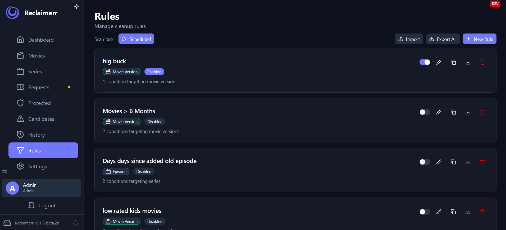

    

<picture></picture>
<picture></picture>
<picture></picture>
<picture></picture>

**Reclaimerr** scans media libraries for eligible items, tracks protection and
deletion requests, and routes the final action through the appropriate service.

- [Getting started](docs/getting-started/index.md)
- [Docker deployment](docs/deployment/docker.md)
- [Contributing](docs/development/contributing.md)

## Capabilities

- Supports Jellyfin, Plex, and Emby
- Integrates with Radarr and Sonarr when configured
- Scans candidates using your reclaim rules
- Respects protection, pending requests, and approval flows
- Supports scheduled tasks, including automatic cleanup deletion
- Can move instead of delete when configured

## Quick Start

1. Install Reclaimerr with Docker, Desktop, or source.
2. Connect at least one media server.
3. Set one server as the main server when multiple servers are configured.
4. Review the task schedule before enabling deletion.

## Support

- [Documentation](https://jessielw.github.io/Reclaimerr/)
- [GitHub Discussions](https://github.com/jessielw/Reclaimerr/discussions)
- Matrix: https://matrix.to/#/#reclaimerr:matrix.org

## Preview

